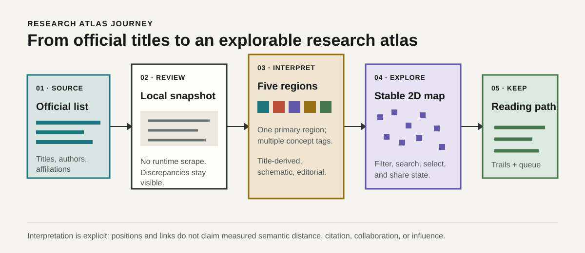
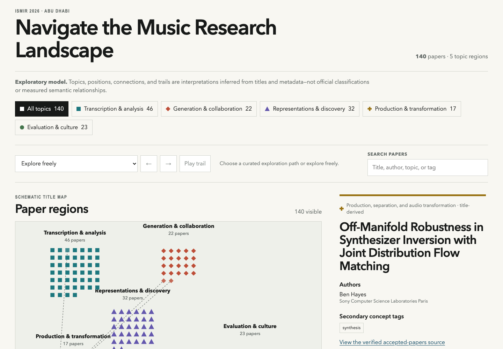

# ISMIR 2026 Research Atlas

An interactive, title-based atlas of accepted papers at ISMIR 2026.

**Deployment target:** `https://jeremybboy.github.io/ismir-2026-research-atlas/` — the production Pages site activates only after the initial implementation pull request is reviewed and merged.



The atlas provides a concise, two-dimensional route from official public metadata to a stable exploratory map. Search, topic filters, paper details, curated trails, shareable URL state, and a browser-local reading queue stay synchronized without a backend.

## Features

- Every accepted paper appears as a keyboard-selectable point in one of five labeled title-derived regions.
- Complete titles, author metadata, concept tags, source links, and related papers remain available without hover.
- Three reviewed trails provide ordered editorial paths through generation, intelligent effects, and musical traditions.
- Search covers titles, authors, topics, and tags; the paper list uses pagination.
- Reading-queue state persists in `localStorage` and exports as lightweight JSON.
- The layout is deterministic, responsive from 320 pixels, and respects reduced-motion preferences.



## Methodological boundary

This independent exploratory visualization is derived from publicly listed ISMIR 2026 paper titles and author metadata. Topic assignments, concept tags, relationships, and guided trails are editorial interpretations and are not official ISMIR classifications.

The authoritative source is the [official ISMIR 2026 accepted-papers page](https://ismir2026.ismir.net/accepted-papers). The application will use a reviewed local snapshot and will not scrape the conference site at runtime.

The snapshot was retrieved on October 6, 2026 and contains 140 papers. See [methodology](docs/methodology.md), the concise [taxonomy audit](docs/taxonomy-audit.md), and [source metadata](data/source-metadata.json).

## Local development

```bash
npm install
npm run dev
```

Run the full local validation used by CI:

```bash
npm test
npm run build
npm run check:links
npm run test:e2e
```

## Architecture and deployment

The browser loads versioned local JSON, derives deterministic map positions, and keeps URL, list, detail, trail, and queue state synchronized. See [docs/architecture.md](docs/architecture.md) for the Mermaid data flow and module boundaries.

GitHub Actions validates every pull request. A separate Pages workflow builds and deploys `main`; therefore the first public deployment occurs automatically only after Jeremy reviews and merges the implementation pull request.

## Contributing

Use the issue templates for bugs, source-data corrections, or focused enhancements. Metadata corrections require a primary source; classification changes must identify title-level evidence and hybrid cases. See [CONTRIBUTING.md](CONTRIBUTING.md).

## Governance

After the bootstrap commit, every change must use a feature branch and pull request. Agents must not push directly to `main`, enable auto-merge, or merge pull requests. See [CONTRIBUTING.md](CONTRIBUTING.md), [AGENTS.md](AGENTS.md), and [SECURITY.md](SECURITY.md).

## License and data rights

Original code is licensed under the [MIT License](LICENSE). Conference metadata, paper titles, author names, affiliations, and paper content remain the property of their respective sources and rights holders; this repository does not claim ownership of them.
