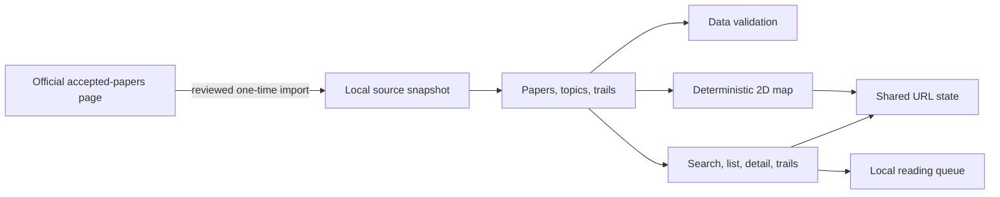

# Architecture

The atlas is a static Vite application. It has no backend, database, runtime AI, or external runtime data dependency.

## Responsibilities

- `data/` contains the dated source record, interpreted paper records, topic definitions, trails, and reconciliation evidence.
- `scripts/import-accepted-papers.mjs` converts a manually retrieved official HTML page into the reviewed local JSON snapshot; it never runs in the public application.
- `scripts/validate-data.mjs` enforces unique IDs and normalized titles, valid references, source metadata, and stable ordering.
- `src/data.js` loads and searches local data and derives explicitly tag-based related papers.
- `src/map.js` owns stable schematic positions and accessible SVG interaction.
- `src/state.js` owns shareable hash state and the browser-local reading queue.
- `src/app.js` synchronizes controls, map, detail view, list, trails, queue, and URL.
- `.github/workflows/ci.yml` validates pull requests; `.github/workflows/deploy-pages.yml` deploys only from `main` after human merge.

## Invariants

The map does not encode measured semantic distance. Connections appear only for the selected paper and mean only that editorial concept tags overlap. Topic regions, tags, trails, and relationships remain title-and-metadata interpretations.
